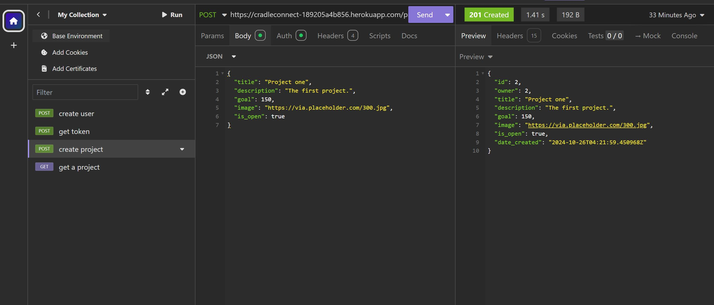
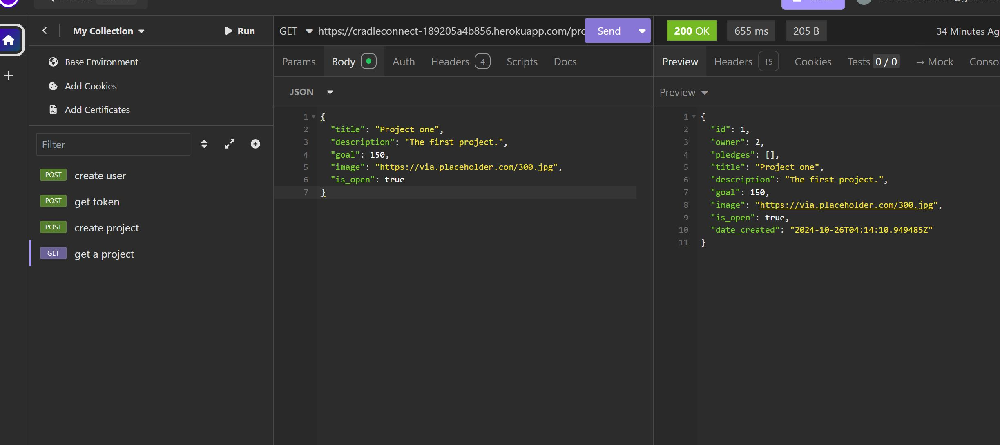

# crowdfunding_back_end
A repo to contain my she codes crowdfunding back end project 
## `README.md` Template Phase 1: API Plan

As your Crowdfunding back end grows, you'll have more and more information to put in the `readme.md` file. For now, you have a rough plan for your project, so let's mark it down!

Below is a template you can use to add your plan to your readme. As usual, {{ double brackets }} indicate places where you should insert your own content. So if your name was Sinead O'Connor, you would swap `Hi, my name is {{ your_name_here }}!` to `Hi, my name is Sinead O'Connor!`

If you're looking for a good way to create your Schema diagram in VS Code, check out [the draw.io integration extension for VS Code](https://marketplace.visualstudio.com/items?itemName=hediet.vscode-drawio)!

To make editing tables in Markdown easier, you might enjoy [the Markdown All-In-One extension](https://marketplace.visualstudio.com/items?itemName=yzhang.markdown-all-in-one). With this installed, you can hit tab inside of any "cell" in a table, and the editor will automatically resize all your columns and create a new row if necessary.

```markdown
# Crowdfunding Back End
{{ Sulakshna Andotra }}

## Planning:
### Concept/Name
{{ Crudleconnect is the name of the website, which helps new parents to get fudings for there new born babies essentials.}}

### Intended Audience/User Stories
{{ The intended audience for this website is primarily new parents who are seeking financial support for essential items and services for their newborns. This includes:

First-time Parents: Individuals or couples experiencing the challenges of parenthood for the first time, who may be unfamiliar with the costs associated with raising a baby.
Low-Income Families: Parents who may be struggling financially and need assistance to provide necessary items such as clothing, diapers, formula, and medical care.
Single Parents: Individuals raising a child on their own, who may face additional financial challenges.
Community Supporters: Friends, family, or community members looking to contribute financially to help new parents. }}

### Front End Pages/Functionality
- {{ The main page allow to know about the website, and allows to request for making account or projects. }}
    - Key Functionalities:
User Registration/Login: Allow new parents to create an account or log in to access personalized features.
Funding Requests: Easy submission form for parents to request funding for baby essentials.
Success Stories: Highlight testimonials and stories from parents who received support.
Navigation Menu: Links to other key pages (Funding Options, Resources, Community).
Call to Action: Prominent buttons for “Get Started” and “Support a Parent.”
- {{ Profile Page }}
Personal space for users to manage their information and requests.
Key Functionalities:
Manage Funding Requests: View, edit, or delete submitted funding requests.
Track Contributions: See donations received and outstanding requests.
Edit Profile Information: Update personal details, including contact information and preferences.
This structure provides a clear roadmap for users, ensuring they can easily navigate the site and access the support they need. Let me know if you need further details or additional pages!

### API Spec
{{ Fill out the table below to define your endpoints. An example of what this might look like is shown at the bottom of the page. 

It might look messy here in the PDF, but once it's rendered it looks very neat! 

It can be helpful to keep the markdown preview open in VS Code so that you can see what you're typing more easily. }}

| URL | HTTP Method | Purpose | Purpose | Request Body | Success Response Code | Authentication/Authorisation |
| --- | ----------- | ------- | ------- | ------------ | --------------------- | ---------------------------- |
|     |             |         |         |              |                       |                              |

API Documentation Table
URL	HTTP Method	Purpose	Request Body	Success Response Code	Authentication/Authorization
/users	GET	Retrieve a list of users	N/A	200	Required
/users	POST	Create a new user	{ "password": "string", "first_name": "string", "last_name": "string", "email": "string" }	201	Required
/users/{id}	GET	Retrieve a specific user	N/A	200	Required
/users/{id}	PUT	Update a specific user	{ "password": "string", "first_name": "string", "last_name": "string", "email": "string" }	200	Required
/users/{id}	DELETE	Delete a specific user	N/A	204	Required
URL	HTTP Method	Purpose	Request Body	Success Response Code	Authentication/Authorization
/projects	GET	Retrieve a list of projects	N/A	200	Required
/projects	POST	Create a new project	{ "title": "string", "description": "string", "goal": "integer", "image": "string", "is_open": "boolean", "campaign_end": "datetime", "owner": "integer" }	201	Required
/projects/{id}	GET	Retrieve a specific project	N/A	200	Required
/projects/{id}	PUT	Update a specific project	{ "title": "string", "description": "string", "goal": "integer", "image": "string", "is_open": "boolean", "campaign_end": "datetime" }	200	Required
/projects/{id}	DELETE	Delete a specific project	N/A	204	Required
URL	HTTP Method	Purpose	Request Body	Success Response Code	Authentication/Authorization
/pledges	GET	Retrieve a list of pledges	N/A	200	Required
/pledges	POST	Create a new pledge	{ "amount": "integer", "comment": "string", "anonymous": "boolean", "project": "integer", "supporter": "integer" }	201	Required
/pledges/{id}	GET	Retrieve a specific pledge	N/A	200	Required
/pledges/{id}	PUT	Update a specific pledge	{ "amount": "integer", "comment": "string", "anonymous": "boolean" }	200	Required
/pledges/{id}	DELETE	Delete a specific pledge	N/A	204	Required
### DB Schema

```

An example API spec:  

Link to deploy project
 https://cradleconnect-189205a4b856.herokuapp.com





Instructions
Prepare the Request:
prepare a POST request.

Set the URL:
Enter the URL for the endpoint: https://cradleconnect-189205a4b856.herokuapp.com/users/

Set the Headers:
Include the Content-Type header set to application/json.
Request Body
{
    "username": "username_here",
  "password": "your_password_here",
  "first_name": "John",
  "last_name": "Doe",
  "email": "john.doe@example.com"
}

Send the Request:
Include the request body as shown above.

Handle the Response:
If successful, you should receive a 201 Created response with details of the new user.

Creating a project

Firstly, we need to get a token for the created user by setting a post request to get token. 
 Entre the URL https://cradleconnect-189205a4b856.herokuapp.com/api-token-auth/
 in the body with JYSON sellted. entre the same as above 
 {
    "username": "username_here",
  "password": "your_password_here",
  "first_name": "John",
  "last_name": "Doe",
  "email": "john.doe@example.com"
} 
get the token.


Prepare the Request for project:

prepare a POST request.
Set the URL:

Enter the URL for the endpoint: https://cradleconnect-189205a4b856.herokuapp.com/projects/

Set the Headers:
Include the Content-Type header set to application/json.

request body:
{
	"title": "Project one",
	"description": "The first project.",
	"goal": 150,
	"image": "https://via.placeholder.com/300.jpg",
	"is_open": true
}

Optionally, include an Authorization header if authentication is required.
Put the copied token in the auth. 
Send the Request:
Include the request body as shown above, making sure to replace the owner field with the actual user_id of the user who is creating the project.

Handle the Response:
If successful, you should receive a 201 Created response with the details of the new project.

